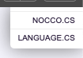
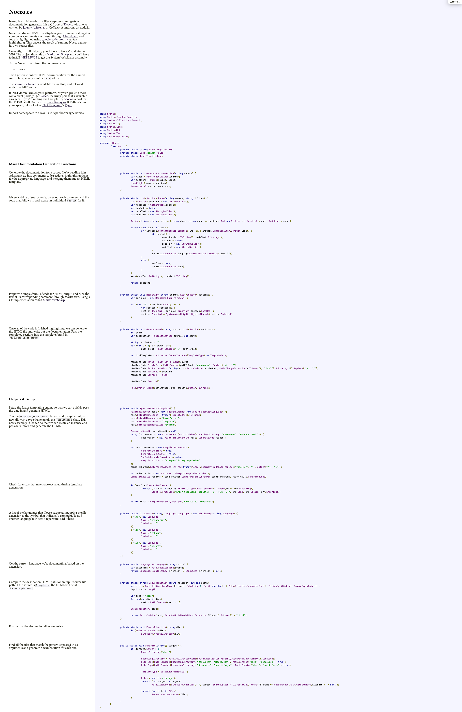

#  nocco

[](https://learn.microsoft.com/en-us/dotnet/csharp/)
[](LICENSE) <!-- https://opensource.org/licenses/MIT -->

> Nocco is a quick-and-dirty, literate-programming-style
documentation generator.

## Run

```bash
nocco *.cs
```

## Install

### NuGet

[](https://www.nuget.org/packages/nocco/)
[](https://www.nuget.org/packages/nocco/)

```bash
dotnet tool install --global nocco
```

```bash
cd src
cd Nocco
dotnet pack
dotnet new tool-manifest
dotnet tool install --add-source bin/Release/ nocco
```

## Location

| OS          | Path                        |
| ----------- | --------------------------- |
| Linux/macOS | $HOME/.dotnet/tools         |
| Windows     | %USERPROFILE%\.dotnet\tools |

## Demo




<details>
<summary>nocco</summary>



</details>

## Solution

[src](src/)

| Project | Type                          | Info |
| ------- | ----------------------------- | ---- |
| nocco   | Microsoft.NET.Sdk.Razor (exe) |      |

## 🧪 Tests

TBA

## Docs

- [docs](docs/README.md)
  - [Contributors](docs/CONTRIBUTORS.md)
  - [Acknowledgements](docs/ACKNOWLEDGEMENTS.md)
  - [Changelog](docs/CHANGELOG.md)
- [LICENSE](LICENSE)

> If .NET doesn't run on your platform, or you'd prefer a more convenient package, get [Rocco](http://rtomayko.github.com/rocco/), the Ruby port that's available as a gem. If you're writing shell scripts, try [Shocco](http://rtomayko.github.com/shocco/), a port for the POSIX shell. Both are by [Ryan Tomayko](http://github.com/rtomayko). If Python's more your speed, take a look at [Nick Fitzgerald](http://github.com/fitzgen)'s [Pycco](http://fitzgen.github.com/pycco/).

---

- https://github.com/dontangg/nocco
 - http://dontangg.github.com/nocco
 - http://donwilson.net/nocco/

---

```bash
  ___         ___         ___        ___        ___   
/' _ `\      / __`\      /'___\     /'___\     / __`\ 
/\ \/\ \    /\ \_\ \    /\ \__/    /\ \__/    /\ \_\ \
\ \_\ \_\   \ \____/    \ \____\   \ \____\   \ \____/
 \/_/\/_/    \/___/      \/____/    \/____/    \/___/ 
```

Nocco is a quick-and-dirty, literate-programming-style
documentation generator. For more information, see:

http://dontangg.github.com/nocco

Nocco is a port of Docco, the original quick-and-dirty, literate-programming-style
documentation generator written in CoffeeScript.

http://jashkenas.github.com/docco/
